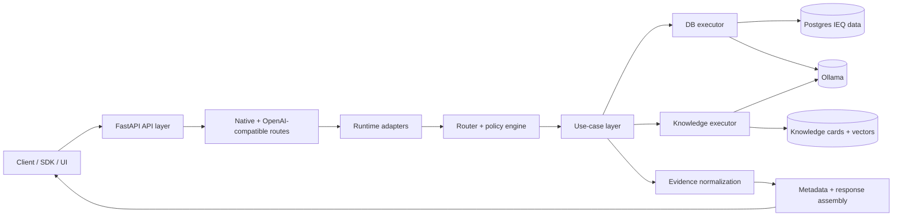
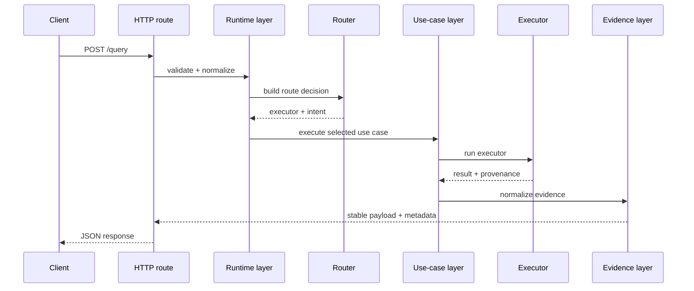
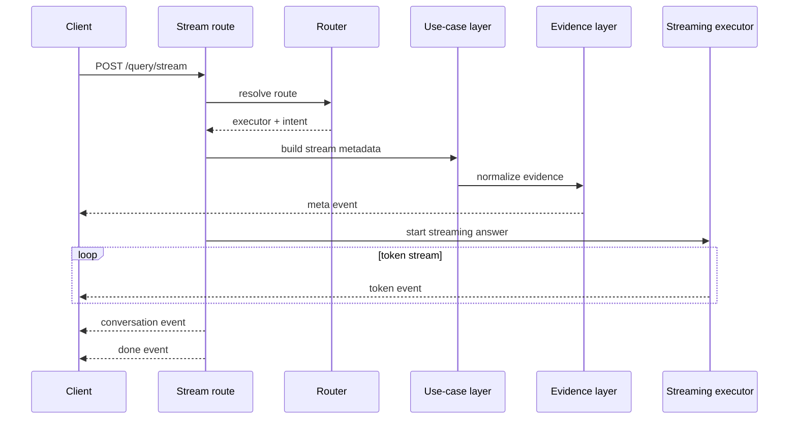
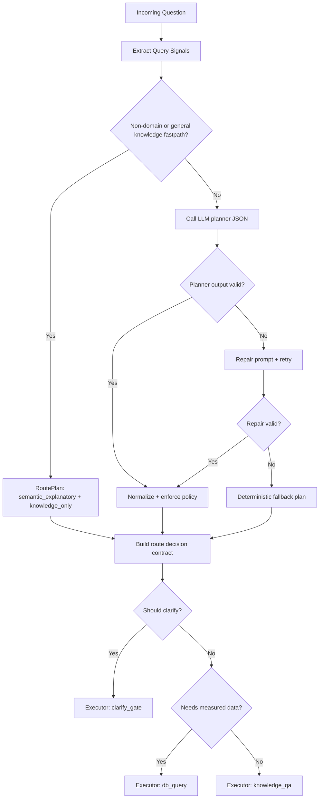

# RAG API Server Deep-Dive Architecture

This document explains exactly how requests move through `RAG_API_SERVER`,
which modules participate, and what each major component/tool is responsible for.

## 1) System At A Glance

## 2) Main Modules And What They Do

| Component | File(s) | Responsibility |
|---|---|---|
| Runtime entrypoint | `rag_api_server.py`, `app_bootstrap.py` | Starts Uvicorn, creates FastAPI app, registers middleware/routes |
| HTTP routes | `http_routes/query_routes.py`, `http_routes/openai_compat_routes.py`, `http_routes/health_routes.py` | Exposes native + OpenAI-compatible APIs |
| Runtime helpers | `http_routes/query_runtime.py`, `http_routes/route_helpers.py` | Shared input normalization, route runtime resolution, metadata and turn persistence |
| Router planner | `query_routing/llm_router_planner.py` | Builds route plan via LLM JSON contract (or fastpath/fallback) |
| Policy engine | `query_routing/route_policy_engine.py` | Converts plan to deterministic executor decision (`db_query`, `knowledge_qa`, `clarify_gate`) |
| Orchestrator | `query_routing/query_orchestrator.py` | Coordinates route plan + contract + branch execution + critic + observability |
| Execution layer | `query_routing/query_orchestrator.py` | Route branch execution and standardized payload assembly |
| DB executor | `executors/db_query_executor.py` + `executors/db_support/*` | Parses query scope, runs SQL branch handlers, optional forecast, LLM rendering/fallback |
| Knowledge executor | `executors/env_query_langchain.py` | Semantic card retrieval + grounded LLM answer/streaming |
| Evidence layer | `evidence/evidence_layer.py` | Validates and repairs provenance/evidence envelopes |
| Observability | `query_routing/observability.py` | In-process KPIs, latency, and error counters |

## 3) Endpoints (External "Tools" Exposed By The Service)

### Native API
- `GET /` : service info and endpoint registry
- `GET /health` : health status
- `GET /health/router` : router safety status
- `GET /observability/metrics` : router/http/error snapshots
- `GET /observability/kpis` : KPI summary + SLO evaluation
- `GET /observability` : live HTML dashboard
- `POST /query/route` : route preview only (no full execution)
- `POST /query/db-proof` : DB evidence/sql-preview helper route
- `POST /query` : full non-stream answer
- `POST /query/stream` : SSE stream (`meta`, `token`, `conversation`, `done`, `error`)

### OpenAI-Compatible API
- `GET /v1/models`
- `POST /v1/chat/completions` (stream/non-stream)

## 4) Full Request Lifecycle (Step-by-Step)

### Step 0: App bootstrap
1. `rag_api_server.py` loads settings and launches Uvicorn.
2. `app_bootstrap.py` builds FastAPI app.
3. CORS middleware and observability HTTP middleware are attached.
4. Routers are registered: health, query, and OpenAI-compatible routes.

### Step 1: Request enters route adapter
1. Route validates input with Pydantic schemas (`http_schemas.py`).
2. Helpers normalize:
   - `k` (`normalize_k`)
   - `lab_name` (`normalize_lab_name`)
   - clarify flag (`normalize_allow_clarify`)
3. Conversation context is resolved (`build_query_context`) and prior turns are prepared.

### Step 2: Route planning (planner + policy)
1. `query_routing/llm_router_planner.py::plan_route` extracts deterministic query signals.
2. Planner behavior:
   - **Fastpath** for clear non-domain/general-knowledge requests.
   - **LLM planner** (JSON-constrained) for normal routing.
   - **Fallback plan** on planner failure.
3. `query_routing/route_policy_engine.py::build_route_decision_contract` enforces deterministic policy:
   - should this be clarify gate?
   - does it need measured DB facts?
   - executor choice (`knowledge_qa`, `db_query`, `clarify_gate`)
   - semantic-to-DB intent remap when needed
4. `query_orchestrator.get_route_decision_contract` builds one deterministic policy contract for execution.

### Step 3: Branch execution

#### A) Clarify gate path
1. Clarify message is generated (`build_clarify_prompt`).
2. Response marks `clarification_required=true`.
3. No DB query or knowledge retrieval is run.

#### B) Knowledge path (`knowledge_qa`)
1. `env_query_langchain.py` performs semantic card retrieval from `env_knowledge_cards`.
2. Retrieved cards are transformed into grounded context sections.
3. LLM generates answer (or general chat handling for non-domain).
4. Evidence envelope is built with knowledge-card provenance.

#### C) DB path (`db_query`)
1. `prepare_db_query` performs:
   - metric selection
   - time-window parsing
   - lab alias resolution
   - invariant validation (scope sufficiency)
2. DB handler executes SQL branch by intent (point/aggregation/comparison/anomaly/forecast).
3. Optional extras:
   - forecast via Prophet path (when forecast intent)
   - chart payload generation
   - card grounding controls from planner hints
4. LLM renders final narrative from structured payload.
5. If LLM fails, deterministic fallback answer is used.
6. Evidence includes DB sources + optional card provenance.

### Step 4: Post-processing guardrails
1. Evidence gets normalized/repaired by `evidence_layer`.
2. Critic checks run in orchestrator (`_apply_critic`), including:
   - metric coverage checks
   - time-window consistency
   - date consistency mismatch blocking
   - evidence-answer alignment
3. Observability snapshot and SLO info are attached to metadata.

### Step 5: Response assembly and persistence
1. Route metadata fields are attached (`route_type`, confidence, reason, executor, etc.).
2. Conversation metadata is attached (`conversation_id`, `turn_index`, context flags).
3. Turn is persisted.
4. Final payload is returned (sync JSON or SSE stream).

### Step 6: Sync/stream metadata parity
1. Stream metadata now uses shared builders in `metadata_builders.py`:
   - `build_stream_clarify_metadata`
   - `build_stream_knowledge_metadata`
   - `build_stream_db_metadata`
2. These builders normalize evidence through `evidence/evidence_layer.py`.
3. Result: `POST /query`, `POST /query/stream`, and OpenAI stream `x_router`
   now share the same normalization rules and metadata contract semantics.

## 5) Non-Stream Sequence (`POST /query`)

## 6) Streaming Sequence (`POST /query/stream`)

## 7) End-To-End Runtime Flow

## 8) Data And Infrastructure Dependencies

### Datastores
- PostgreSQL measured data table(s), primarily `lab_ieq_final`
- PostgreSQL knowledge table `env_knowledge_cards` (semantic retrieval)
- Conversation history store (`storage/conversation_store.py`)

### Model and vector dependencies
- Ollama endpoint for planner and answer generation
- Embedding generation (`storage/embeddings.py`) for knowledge card semantic search
- Prophet optional dependency for forecast generation in DB branch

## 9) Metadata And Evidence You Can Rely On

Common high-value metadata fields:
- route-level: `route_source`, `route_type`, `intent_category`, `route_confidence`, `route_reason`
- execution-level: `executor`, `execution_intent`, `intent_rerouted_to_db`
- model/planner: `planner_model`, `planner_fallback_used`, `planner_fallback_reason`
- data scope: `lab_name`, `resolved_lab_name`, `time_window`, `sources`
- response quality: `llm_used`, critic statuses, observability snapshot
- conversation: `conversation_id`, `turn_index`, carry-over fields

Evidence guarantees:
- Always normalized to a stable shape before final response mapping
- Invalid evidence is repaired deterministically (never raw-untyped leakage)
- Provenance sources explicitly record DB and/or card origin

## 10) Debugging And Verification Checklist

1. `GET /health` for process health.
2. `GET /health/router` to verify router/slo status.
3. `POST /query/route` to inspect route decision before full execution.
4. `POST /query/db-proof` to inspect DB SQL preview/bindings and row sample.
5. `GET /observability/kpis` for fallback rates, latency, and error trends.
6. `POST /query/stream` when validating token flow and SSE metadata ordering.

## 11) Practical "How It Works" Summary

1. Input arrives through native or OpenAI-compatible HTTP adapters.
2. Planner proposes a route plan; policy engine enforces deterministic executor selection.
3. Orchestrator executes exactly one branch (clarify, knowledge, or DB).
4. Branch result is normalized (evidence + metadata), then critic checked.
5. Conversation and observability metadata are attached.
6. Response returns in contract-stable shape for sync or stream clients.
