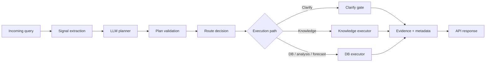
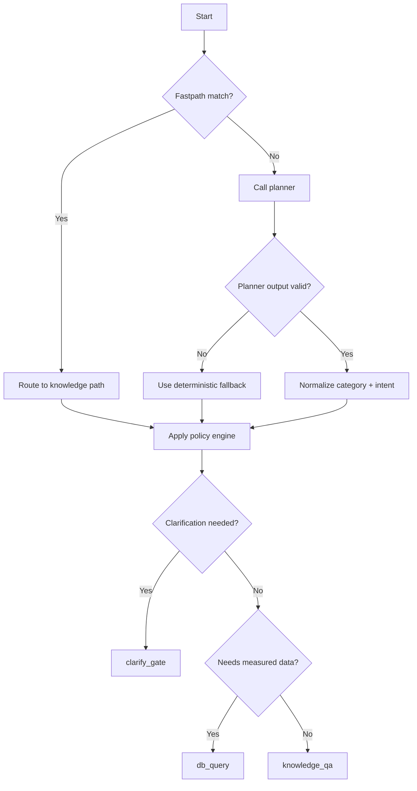

# Router Architecture

For full end-to-end request flow (not only routing), see `docs/architecture_deep_dive.md`.

## Purpose

The router decides exactly one execution path per query:

- structured DB lookup
- analytical/visualization query
- prediction/forecast

Routing is LLM-planned with deterministic policy validation.

## Intent Taxonomy

The planner returns:

- `intent_category`: high-level user intention
- `intent`: executable backend route intent

Allowed categories:

- `semantic_explanatory`
- `structured_factual_db`
- `analytical_visualization`
- `prediction`

Allowed executable intents:

- `definition_explanation`
- `current_status_db`
- `point_lookup_db`
- `aggregation_db`
- `comparison_db`
- `anomaly_analysis_db`
- `forecast_db`
- `unknown_fallback`

Category-to-intent constraints:

- `semantic_explanatory` -> `definition_explanation | unknown_fallback`
- `structured_factual_db` -> `current_status_db | point_lookup_db | aggregation_db`
- `analytical_visualization` -> `comparison_db | anomaly_analysis_db`
- `prediction` -> `forecast_db`

## Request Flow



## Progressive Contracts + Evidence Layer

The server uses progressive contracts to keep development flexible:

- stable core fields are validated and relied on by downstream layers
- optional extension fields can evolve without breaking callers
- contract versioning allows safe evolution over time

Evidence is now treated as an explicit layer:

- executors return raw evidence/provenance
- evidence layer normalizes + validates payload shape
- repaired evidence is emitted deterministically when raw payload is invalid
- response mappers and critic checks consume a single normalized evidence envelope

## Routing Decision Tree



## Planner Contract

Planner output must be strict JSON:

```json
{
  "intent_category": "structured_factual_db",
  "intent": "point_lookup_db",
  "confidence": 0.82,
  "reason": "explicit_timestamp_and_metric_lookup"
}
```

Validation rules:

- all keys required
- `intent_category` and `intent` must be from allowed enums
- category-intent pair must be valid
- exactly one executable intent per query

If validation fails, router falls back to deterministic planner fallback rules.

## Configuration

Planner settings:

- `OLLAMA_ROUTER_BASE_URL` (fallback `OLLAMA_BASE_URL`)
- `OLLAMA_ROUTER_MODEL` (default `qwen3:30b`)
- `OLLAMA_ROUTER_TEMPERATURE` (default `0.0`)
- `OLLAMA_ROUTER_THINKING` (default `false`)
- `OLLAMA_ROUTER_TIMEOUT_SECONDS` (default `8`)

Answer generation settings remain separate:

- `OLLAMA_MODEL` for answer generation
- `OLLAMA_BASE_URL` for answer generation

Server/runtime settings (centralized in `core_settings.py`):

- `RAG_API_HOST`
- `RAG_API_PORT`
- `RAG_API_CORS_ALLOW_ORIGINS`
- `RAG_API_CORS_ALLOW_CREDENTIALS`
- `RAG_API_CORS_ALLOW_METHODS`
- `RAG_API_CORS_ALLOW_HEADERS`
- `ROUTER_CLARIFY_THRESHOLD`

## Metadata Contract

Route metadata fields added to responses:

- `route_source` (`llm_planner`, `signal_fastpath`, or `planner_rule_fallback`)
- `route_type` (executable intent)
- `intent_category`
- `route_confidence`
- `route_reason`
- `planner_model`
- `planner_fallback_used`
- `planner_fallback_reason`
- `execution_intent` (actual executor intent after card-intent remap)
- `intent_rerouted_to_db` (boolean)
- `sources` (ground-truth provenance)

Where metadata appears:

- `POST /query` -> `response.metadata`
- `POST /query/stream` -> initial SSE `meta` event
- `POST /v1/chat/completions` non-stream -> `x_router`
- `POST /v1/chat/completions` stream -> first chunk `x_router`

Sync/stream consistency notes:

- Stream metadata is built through shared helpers in `query_use_cases.py`
  (`build_stream_clarify_metadata`, `build_stream_knowledge_metadata`,
  `build_stream_db_metadata`).
- Stream evidence is normalized/repaired through `evidence/evidence_layer.py`
  the same way as non-stream contracts.

## Ground-Truth Sources

`sources` carries provenance by execution path:

- DB path:
  - source table (`lab_ieq_final`)
  - operation type (`point_lookup`, `aggregation`, `comparison`, `timeseries`, `prediction`)
  - metric, time window, lab scope, compared spaces, row count
- Knowledge grounding:
  - source table (`env_knowledge_cards`)
  - `card_type`, `topic`, `title`, `source_label`
- Prediction:
  - historical range used
  - model name
  - requested/effective forecast horizon
  - confidence metrics

## Reliability Notes

- Non-stream route execution is threadpool-offloaded in HTTP route adapters to reduce event-loop blocking.
- Runtime errors are normalized through `runtime_errors.py` into stable codes:
  - `invalid_input`
  - `routing_error`
  - `execution_error`
  - `stream_error`
  - `internal_error`
